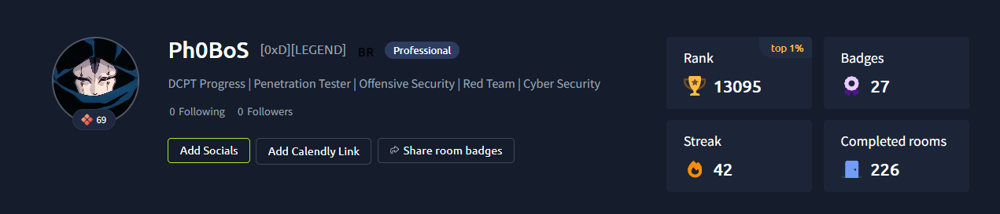

<!-- BANNER -->

  

 

<!-- CONTACT -->

---

> *"The firewalls fade, and the lords of the domain go without patching. Only embers of access remain."*
> *— Someone must extinguish thy defenses.*

---

 

**`Penetration Tester · Red Team · Offensive Security`**

 

Caçador de vulnerabilidades com foco em **testes de invasão, red team operations e offensive security**. Constantemente afiando meu arsenal, onde cada exploração bem-sucedida concede um novo Insight para a caçada.

Trabalho ativamente com enumeração, exploração, escalada de privilégios e evasão de defesas. Do acesso inicial à documentação do relatório de pentest.

 

## ⚔️ Arsenal — Tools

 

## 🩸 Languages & Tech

 

## 🕯️ Certifications and Training

| | Course / Certification | Status |
|:---:|:---|:---:|
| ◈ | DCPT — Desec Certified Penetration Tester | 🔄 In Progress |
| ◈ | Pentest Experience V2 - Desec Security | ✅ Complete |
| ◈ | Novo Pentest Profissional - Desec Security | ✅ Complete |
| ◈ | Ethical Hacker - Cisco Networking Academy | ✅ Complete |
| ◈ | Endpoint Security- Cisco Networking Academy | ✅ Complete |
| ◈ | Cybersecurity - FIAP | ✅ Complete |
| ◈ | Cybersecurity Fundamentals - IBM | ✅ Complete |

 

## 🗡️ TryHackMe Stats

 

## 📊 Statistics

 

## 📜 Contribution Graph

 

*† The night is long, and the Hunt does not end. Seek the root beyond the veil. †*

